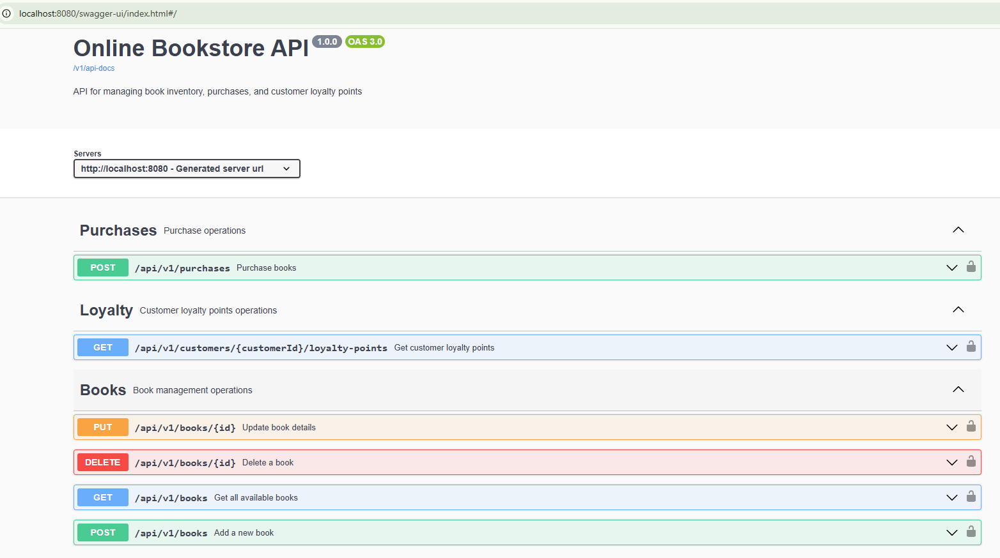
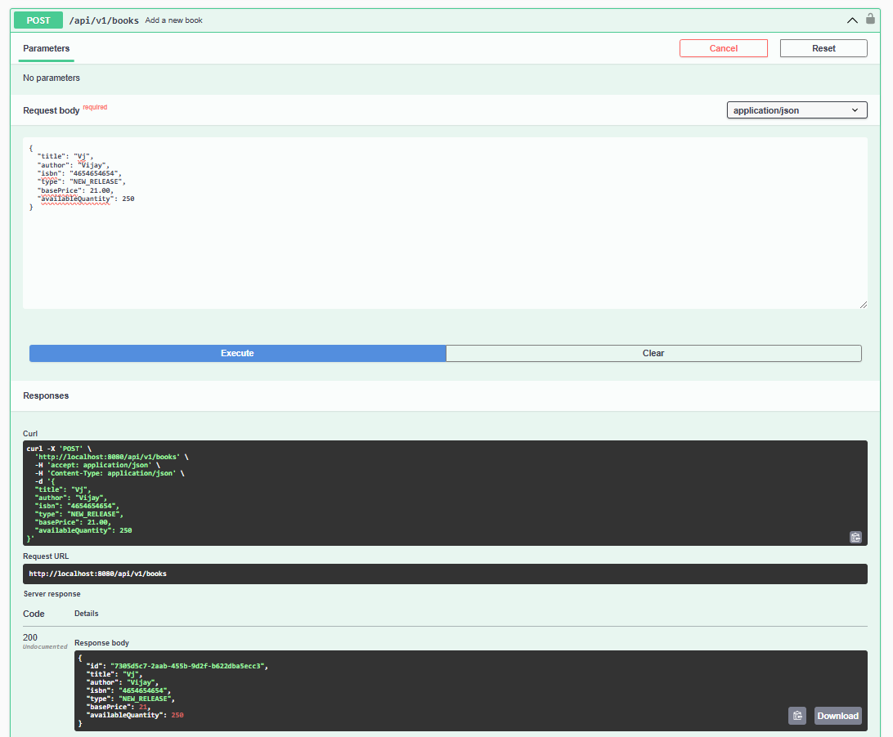
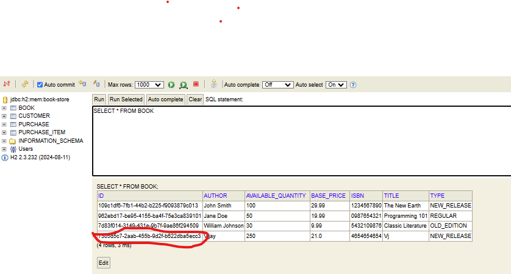
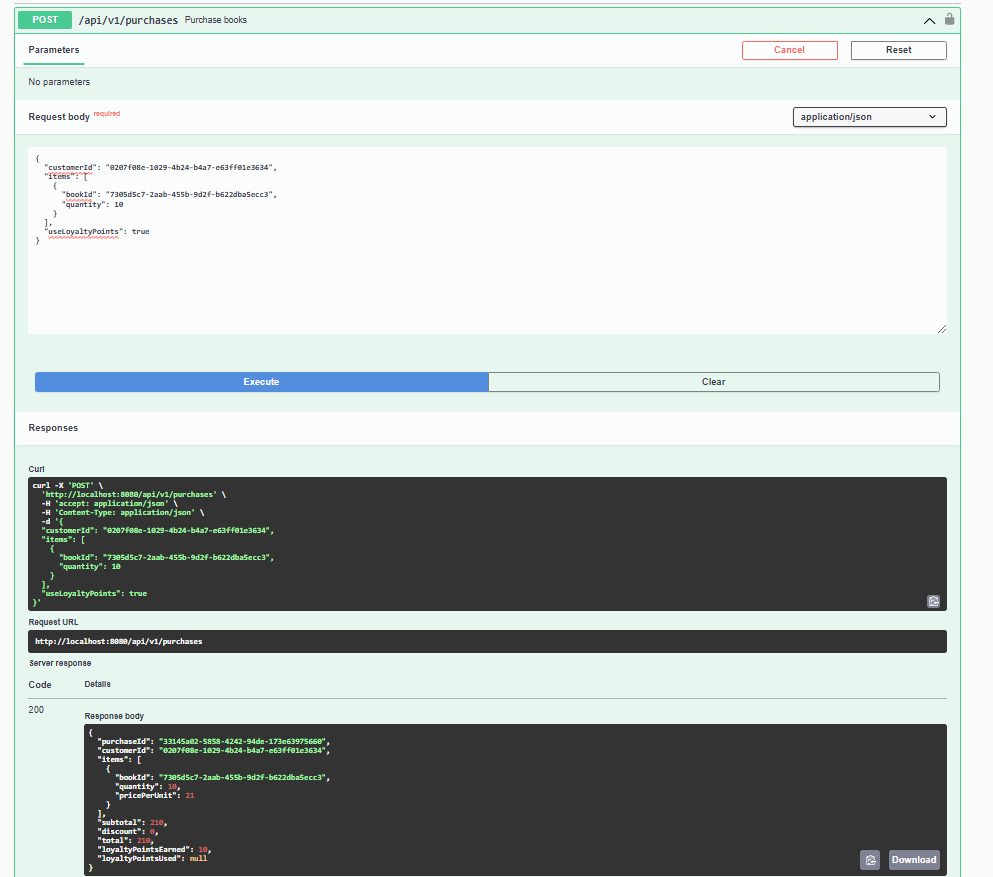
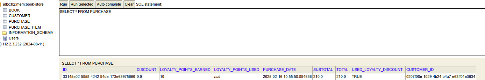
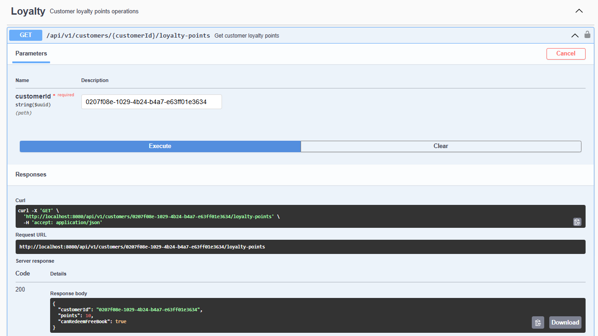

# Book Store Application API

## Overview

This application provides a RESTful API for managing an online bookstore. It includes various features such as:

- **Book Management**: Create, read, update, and delete books.
- **Purchase Management**: Allow customers to purchase books with loyalty points integration.
- **Loyalty Points**: Track and manage customer loyalty points for discounts.

The project uses **Java**, **Spring Boot**, **openApi**, **Maven**, **JUnit**, and **Swagger** for documentation.

---

## How to Run the Solution

### Prerequisites

- **Java 17 or later** (Ensure that `java` and `javac` commands are available in your PATH).
- **Maven 3.x** (Ensure `mvn` command is available in your PATH).
- **IDE** (Optional, but recommended: IntelliJ IDEA, Eclipse, or Visual Studio Code).

The **Design Decisions** section now includes explanations for points 2 to 5, covering the **Loyalty Points System**, **Error Handling**, **Testing**, and **Data Layer** decisions made throughout the project.

### Steps to Run Locally

 **Clone the Repository**:
   Clone this repository to your local machine using Git:
   ```bash
   git clone https://github.com/vijayareddyk11/book-store.git 
   
   mvn clean install
    
   mvn generate-sources
   
   mvn spring-boot:run
   
   http://localhost:8080/swagger-ui.html
   
   ```

## Screenshots

Here are some screenshots of the application in action:

1. **Swagger API Documentation**  
     
   *This screenshot shows the Swagger UI where you can test the API endpoints.*

2. **Sample Book Creation**  
     
   
   *This screenshot shows the form for creating a new book.*

3. **Purchase Confirmation**  
     
     
   *This screenshot shows the confirmation after a successful purchase.*

4. **Loyalty Points Overview**  
     
   *This screenshot shows the customer’s loyalty points after a purchase.*

---


### Project Overview
Why Loyalty Points?: The goal was to introduce a mechanism that incentivizes customers to make more purchases. The customer can use loyalty points to get discounts on future purchases.

Loyalty Points Calculation: The points are earned after each purchase, with logic to apply the points as a discount in future purchases. For example, customers can redeem a certain number of points to receive discounts on future purchases or even free items based on the points threshold.

MapStruct was used to easily map between entities (e.g., Customer, Book) and DTOs (CustomerDTO, BookDTO).

### Data Layer
H2 Database: During development and testing, we used an in-memory H2 database. In production, this can be swapped with a more robust database like PostgreSQL or MySQL.

Repositories: We used Spring Data JPA repositories to handle CRUD operations for entities like Book, Customer, and Purchase. These repositories abstract away most of the database interaction, allowing us to focus on the business logic of the application.

### Testing
JUnit 5 was used for unit testing. Mockito was used to mock the services and repositories.

Test Coverage: The focus was on testing the service layer to verify business logic and the controller layer to ensure API responses were correct. Integration tests were written to test the communication between the API and the database.

Mocking: Mocking was done using Mockito to isolate each test case, allowing us to focus on testing individual components without interacting with the real database or external services.